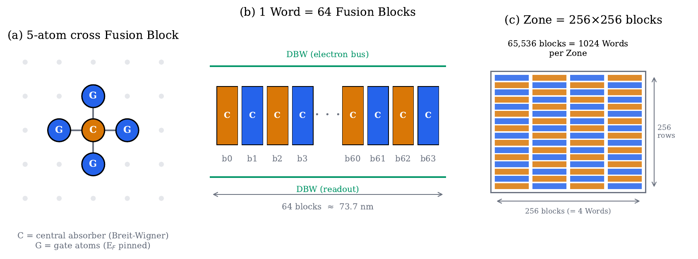
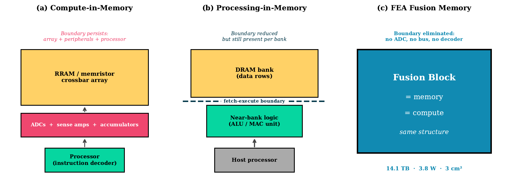
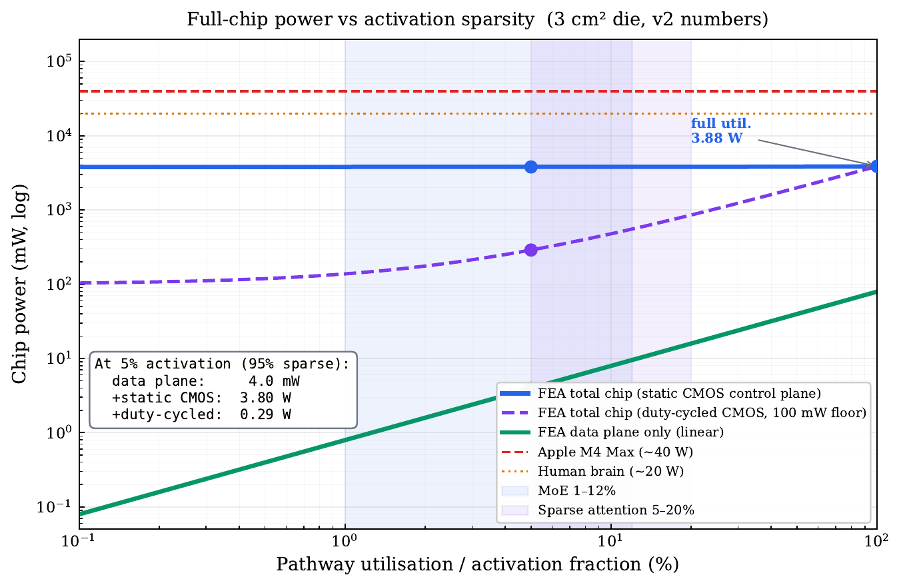

# FEA — Free Electron Absorption Architecture

**A transistor-free computing architecture on hydrogen-passivated silicon.**

Electrons travel freely along dangling bond wires on H–Si(100) and are selectively absorbed by 5-atom cross-shaped dangling-bond clusters via Breit–Wigner resonance under gate-voltage control. No transistors switch in the data plane. Each Fusion Block = 1 bit. 64 Fusion Blocks = 1 64-bit Word. The CMOS control plane is an address sequencer — it never touches operand data.

<p align="center">
  
</p>

<p align="center"><em>Architectural hierarchy: 5-atom Fusion Block (a), 64-bit Word (b), and 256×256-block Zone (c). A 3 cm² die contains ~1.7 × 10⁹ Zones.</em></p>

> **Preprint:** [](https://doi.org/10.5281/zenodo.19559255)
>
> - **Zenodo (canonical, citable):** [https://doi.org/10.5281/zenodo.19559255](https://doi.org/10.5281/zenodo.19559255)
> - **Local copy:** [`Paper/FEA-architecture.pdf`](Paper/FEA-architecture.pdf) — 22 pages, 8 figures, 14 simulations, 13 references.
>
> **Note on simulation versions.** The Zenodo preprint reports numbers from
> `FEA_sim_v1.cpp` (archived in [`simulations/`](simulations/) for
> reproducibility). The current reference implementation is
> [`FEA_sim_v2.cpp`](simulations/FEA_sim_v2.cpp), which adds first-principles
> Γ derivation, a real 2D thermal solver, contention-model crossbar, and a
> self-consistent multi-FIRE write-fidelity model. Numbers below are the
> v2 values; deltas from v1 are noted where they differ materially. The
> Zenodo preprint will be updated to v2 after editorial decision on the
> accompanying Nature Electronics submission.

---

## Key Numbers

| | Value |
|---|---|
| Physical primitive | 5-atom cross DB cluster on H-Si(100) |
| 1 Fusion Block | 1 bit (absorbed or not absorbed) |
| 1 Word | 64 Fusion Blocks = 64-bit register |
| Practical block density | **3.77 × 10¹³ cm⁻²** |
| System clock (T_cycle = 108.85 ps) | **9.19 GHz** |
| Resonance broadening Γ (derived from leads) | **45 meV** (v1 used 8 meV hardcoded) |
| Data-plane power density (P_transit + P_absorb) | 26.47 mW/cm² |
| Charging energy E_C | 0.65 eV |
| State retention τ_ret at 300 K | **52.2 ms** |
| Refresh overhead | **0.011%** (compute utilisation 99.99%) |
| ADD_64, single-FIRE ideal | 0.87 ns (8 cycles) |
| ADD_64, multi-FIRE (N_FIRE = 18, 99.9% write fidelity) | **2.72 ns** (25 cycles) |
| MUL_64, single-FIRE ideal | 2.18 ns (20 cycles) |
| MUL_64, multi-FIRE | **~4.03 ns** (37 cycles) |
| Slingshot hop (8-lane parallel) | **1.09 ns** |
| M4-Max-sized die (3 cm²) data-plane | **14.1 TB in-situ memory, 79.4 mW** |
| M4-Max-sized die total chip power (incl. CMOS control plane) | **~3.8 W** |

**Comparison to Apple M4 Max on the same 3 cm² die area:**
110× more memory at ~10× lower total chip power (3.8 W vs 40 W).
The data plane alone is ~500× lower power; the CMOS control plane
dominates the total and is the primary target for future optimisation.

---

## Simulation Suite — 14 Simulations (v2)

The current simulation — [`simulations/FEA_sim_v2.cpp`](simulations/FEA_sim_v2.cpp) (~1,370 lines C++17, no external dependencies) — verifies the architecture end-to-end. v1 values in parentheses where they differ.

| # | Name | Description |
|---|------|-------------|
| 1 | 5-atom Hamiltonian + lead self-energy | Jacobi diagonalisation of the 5×5 tight-binding Hamiltonian; bonding/antibonding eigenvalues vs V_NE; **Γ derived from lead self-energy: 45 meV** (v1: 8 meV hardcoded) |
| 2 | Transmission: Green's function vs Breit–Wigner | T(E) from full Green's function compared against single-pole BW approximation; injection-averaged capture probability |
| 3 | Kramers retention + Langevin MC cross-check | τ_ret = 52.2 ms; first-passage distribution confirmed exponential (Kramers-consistent) |
| 4 | DBW wavepacket with embedded cluster | Crank–Nicolson on 500-site chain with 5-atom cluster at site 250; measured on/off absorption contrast ~1,066× |
| 5 | 64-bit CLA ADD with multi-FIRE redundancy | Block-level model; automatic N_FIRE search; **N_FIRE = 18 → 0/1,000 functional failures → 2.72 ns effective ADD_64** |
| 6 | ARM/FIRE/CONFIRM timing | 33 + 42.9 + 33 = 108.85 ps cycle |
| 8 | Density, memory & derived power breakdown | 14.1 TB; P_transit + P_absorb + P_gate with explicit activity-factor sensitivity |
| 9 | 2D steady-state thermal (SOR solver) | **ΔT_max ≈ 1.07 K at central hot spot with CMOS control plane** (data-plane only: < 3 mK) |
| 10 | FEA VM — three programs, 100-run MC | Vector add 96% full-pass, dot product 98% match, conditional branch 98% match (all with multi-FIRE + thermal escape) |
| 11 | Room-temperature full-chip stability | M4-die epoch-based MC: 99.99% compute utilisation under τ/2 refresh |
| 12 | Crossbar contention (real arbitration) | **Row-broadcast/sequential: 147 / random: 133 / worst-case strided: 9 GOPS/zone** (v1 idealized: 2,352/147) |
| 14 | Fusion Memory cross-die access | Hierarchical fat-tree routing on 10⁵ random Word pairs: 95th percentile 32 hops (34.8 ns), worst case 34 hops (37.0 ns) |

SIM 7 (Bernoulli self-check) and SIM 13 (multi-hop dice-rolling) from v1 were tautologies and have been removed; the physical content is covered by SIM 3's Langevin cross-check and SIM 5's block-level CLA simulation. See [`simulations/README.md`](simulations/README.md) for the full v1 → v2 change log.

---

## Build & Run

Requires any C++17 compiler (clang, gcc). No external libraries.

Source lives in [`simulations/`](simulations/). Two versions are
kept for transparency:

- [`simulations/FEA_sim_v2.cpp`](simulations/FEA_sim_v2.cpp) —
  **current**, matches the NE manuscript. First-principles Γ, real
  2D thermal solver, contention-model crossbar, multi-FIRE write
  model with SIM 5 / SIM 10 self-consistent.
- [`simulations/FEA_sim_v1.cpp`](simulations/FEA_sim_v1.cpp) —
  archived, matches the Zenodo preprint (DOI 10.5281/zenodo.19559255).
  Known limitations documented in
  [`simulations/README.md`](simulations/README.md).

```bash
make          # builds FEA_sim_v2 (the current one)
make run      # builds and runs v2
make v1       # builds the archived v1
```

Or in one line:
```bash
c++ -std=c++17 -O2 -o FEA_sim_v2 simulations/FEA_sim_v2.cpp && ./FEA_sim_v2
```

Captured reference outputs live alongside the source:
[`simulations/FEA_sim_v2_output.txt`](simulations/FEA_sim_v2_output.txt)
and
[`simulations/FEA_sim_v1_output.txt`](simulations/FEA_sim_v1_output.txt).

---

## Architecture Overview

```
  1 Fusion Block  =  1 bit    (5-atom cross DB cluster)
  64 Fusion Blocks =  1 Word   (64-bit parallel register)
  1024 Words       =  1 Zone   (256×256 = 65,536 blocks)
  ~10⁹ Zones       =  1 Chip   (3 cm² M4-Max die)
```

<p align="center">
  
</p>

<p align="center"><em>Compute–memory integration. (a) Compute-in-memory preserves the array/processor boundary and needs ADCs, accumulators, and a separate decoder. (b) Processing-in-memory keeps the fetch–execute boundary within each bank. (c) FEA Fusion Memory: every Fusion Block is simultaneously the memory cell and the compute unit — no peripheral circuitry, no data converter in the compute path.</em></p>

**Instruction set (5 micro-ops, issued by CMOS control plane):**

- `ARM`       — address target Word within a Zone  (1 cycle)
- `FIRE`      — execute 64-bit ALU op on armed Word  (1–20 cycles)
- `CONFIRM`   — read back result via AC charge sensing  (1 cycle)
- `SLINGSHOT` — transfer 64-bit value between Words, 8-lane parallel  (10 cycles)
- `BRANCH`    — conditional jump  (1 cycle, no speculation)

---

## Key Results

**Physics.**
The 5-atom cross cluster has a smaller self-capacitance than the 16-atom 4×4 clusters used in prior work, giving E_C = 0.65 eV and E_C/k_B T = 25.1 at 300 K. Kramers escape is exponentially suppressed, yielding τ_ret = 52.2 ms. The resonance broadening Γ ≈ 45 meV is derived from the lead self-energy (rather than hardcoded).

**Arithmetic.**
Carry-lookahead adders and Wallace-tree multipliers, implemented natively on parallel Fusion Blocks, give 64-bit ADD in 0.87 ns and MUL in 2.18 ns under the single-FIRE ideal. When the measured per-electron absorption from SIM 4 (0.46) is taken as the physical write probability, the simulation shows that **N_FIRE = 18 multi-FIRE writes** are required to reach 99.9% per-op fidelity, raising effective latencies to **~2.72 ns (ADD)** and **~4.03 ns (MUL)**. Chained programs add standard SECDED ECC on top.

**General-purpose execution.**
The ARM/FIRE/CONFIRM + SLINGSHOT + BRANCH instruction set supports arithmetic, unbounded memory addressing, and conditional control flow on 64-bit Words — the three ingredients for Turing-completeness. SIM 10 runs three example programs (vector add, dot product, conditional branch) 100 times each under the multi-FIRE + thermal-noise model and reports 96–98% full-program success. A compiler is future work.

**Chip scale.**
A 3 cm² M4-Max-sized die hosts 1.13 × 10¹⁴ Fusion Blocks and 14.1 TB of in-situ memory. The data plane alone dissipates 79.4 mW (approximately 500× lower than an M4 Max GPU on the same die area); total chip power including the CMOS control-plane estimate is **~3.8 W (approximately 10× lower than M4 Max)**. Monte Carlo simulation on the full die confirms 99.99% compute utilisation under periodic refresh at 300 K. The 2D thermal solver shows ΔT ≈ 1 K at worst-case hot spots with CMOS power included.

**Sparse workloads — full-chip honesty.**
The data plane has no dark-silicon floor: a 95%-sparse transformer dissipates only ~4 mW in the data plane on a full 3 cm² die. **But that is only the data-plane number.** At the full-chip level, the CMOS control-plane estimate (~3.8 W, dominated by PLL distribution) dominates unless it is actively duty-cycled. The three relevant numbers at 5% activation are:

| Measurement | Power at 5% activation |
|---|---|
| Data plane only (green curve below) | **~4 mW** |
| Full chip, static CMOS (blue curve) | **~3.81 W** |
| Full chip, duty-cycled CMOS, 100 mW floor (purple curve) | **~0.29 W** |

In all scenarios, the data-plane itself is ~500× more energy-efficient than CMOS equivalents for sparse compute. Capturing that advantage at the chip level is a control-plane engineering problem, not a physics limitation.

<p align="center">
  
</p>

<p align="center"><em>Full-chip power vs pathway utilisation / activation fraction (3 cm² die, log–log). Three FEA curves: data plane only (green, linear), total chip with static CMOS (blue, 3.8 W floor), total chip with duty-cycled CMOS (purple, 100 mW floor). Apple M4 Max and the human brain are flat references.</em></p>

---

## Limitations

- **Room-temperature DB retention has not been experimentally measured.** All retention figures are Kramers-model extrapolations from cryogenic (4 K) STM measurements. This is the principal unvalidated assumption and the open experimental question.
- **No compiler.** Instruction traces in SIM 10 are hand-compiled. An LLVM backend targeting the FEA ISA is future work.
- **Fabrication.** Writing single 5-atom clusters with STM is within current capabilities; scaling to 10¹⁴ clusters on a 3 cm² die requires parallel atomic-precision patterning (directed self-assembly or template-assisted placement).

The paper describes these in detail. Experimental collaborators with atomic-precision silicon capabilities are welcome.

---

## Citation

Please cite via the Zenodo DOI — it's the canonical, citable reference:

```bibtex
@misc{ali2026fea,
  author       = {Ali, Syed Abdur Rehman},
  title        = {Free Electron Absorption: A Bit-Level Transistor-Free Computing
                  Architecture on Hydrogen-Passivated Silicon},
  year         = 2026,
  month        = apr,
  publisher    = {Zenodo},
  version      = {v1.0},
  doi          = {10.5281/zenodo.19559255},
  url          = {https://doi.org/10.5281/zenodo.19559255},
}
```

Plain-text form:

> Ali, S. A. R. (2026). *Free Electron Absorption: A Bit-Level Transistor-Free Computing Architecture on Hydrogen-Passivated Silicon* (v1.0). Zenodo. https://doi.org/10.5281/zenodo.19559255

---

## License

Code: MIT — see [LICENSE](LICENSE).

---

**Author:** Syed Abdur Rehman Ali — Independent Researcher
[ORCID: 0009-0004-6611-2918](https://orcid.org/0009-0004-6611-2918)
