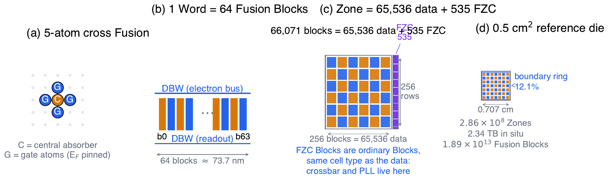
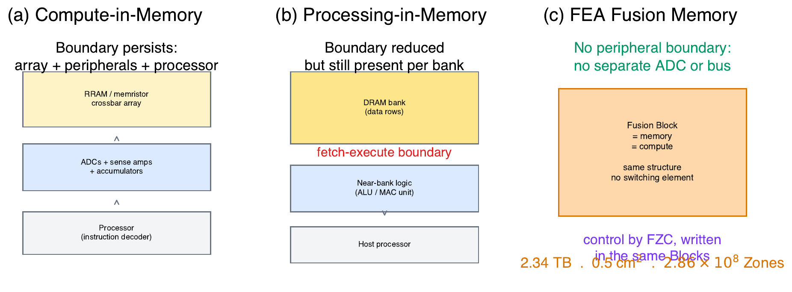

# FEA — Free Electron Absorption Architecture

A proposed computing architecture with a transistor-free data plane, on
hydrogen-passivated Si(100).
Electrons travel along dangling bond wires (DBWs); 5-atom cross-shaped
dangling-bond clusters are modelled to undergo resonant occupation by
passing electrons via Breit–Wigner resonance under gate-voltage control.
Persistent capture additionally requires a post-write isolation mechanism
that the model does not supply, and is stated as an open requirement rather
than an achieved result. One Fusion Block represents one stored bit in the
architectural model; 64 Fusion Blocks form a 64-bit Word, and 1,024
Words form a Zone.

Control is carried by a *Fusion Zone Controller* (FZC) assembled from the
same Fusion Blocks, so each Zone adds 535 controller Blocks and no second cell
design: decoding, sequencing and sense amplification are assigned to the FZC
rather than to a separate peripheral block. Typed packets move data,
refresh, boot and recovery over a transport called *Slingshot*, whose model
states no physical time or energy per hop.

<p align="center">
  
</p>

<p align="center"><em>Fusion Block (a), 64-bit Word (b), and the Zone (c).</em></p>

**Code archive:** [10.5281/zenodo.21902252](https://doi.org/10.5281/zenodo.21902252) &nbsp;·&nbsp; **Preprint (v1):** [10.5281/zenodo.19559255](https://doi.org/10.5281/zenodo.19559255)
· **Architecture paper (PDF):** [`Paper/FEA-architecture.pdf`](Paper/FEA-architecture.pdf)

The numbers below are the current revision's, produced by the verification
suite in [`simulations/`](simulations/). The current revision supersedes v1
for the values reported here; v1 is retained unchanged for provenance.

---

## Key Numbers

| | Value |
|---|---|
| Physical primitive | 5-atom cross DB cluster on H-Si(100) |
| 1 Fusion Block | 1 bit |
| 1 Word | 64 Fusion Blocks |
| 1 Zone | 66,071 Blocks = 65,536 data + 535 FZC |
| Practical block density | 3.77 × 10¹³ cm⁻² |
| Reference die | 0.5 cm² |
| Zones on the reference die | 2.86 × 10⁸ |
| In-situ capacity (raw array) | 2.34 TB |
| Fully accounted, all declared support reserved | 1.83 TB |
| Resonance broadening Γ (derived) | 45 meV |
| Adopted charging energy E_C | 0.65 eV (assumed escape barrier) |
| Kramers-model retention estimate at 300 K | 52.2 ms (not measured) |
| Local clock (`T_cycle` = 104.83 ps) | 9.54 GHz (same-Block, not a die-wide rate) |
| Data-plane power | 13.2 mW (26.47 mW/cm²) |
| Accounted whole-chip floor (four sized terms) | 0.0234 W |
| Declared whole-chip upper bound, incl. four unsourced terms | 14.9 W |
| Refresh duty / local traffic | 3.68 × 10⁻⁶ / 90,440 GB/s |
| ADD_64 structural / reference estimate | 0.84 ns / 2.62 ns |
| MUL_64 structural / reference estimate | 2.10 ns / 3.88 ns |
| SECDED physical-bit overhead on a 64-bit Word (not a latency multiplier) | 1.125× |
| Modelled steady-state corner rise | 1.29 K (ideal back-face sink, no package) |
| Cross-die path rate | 0.065 GHz |
| Zones able to fire in any cycle (stated pathway inputs) | 1.31 × 10⁷ of 2.86 × 10⁸, about 4.6% — sustainable fraction unvalidated |
| Issue width | one Word per Zone per cycle; more Words per cycle lowers the Zone fraction but leaves active Words and throughput unchanged |
| Model-derived flux deficit at full-rate firing | 21.9x |

---

## Verification Suite

19 modules, each with a gate that can fail: physics, retention, clock,
SECDED, crosstalk, restoration, refresh, bandwidth, power, fabrication,
floorplan, programmability, recovery, rescue, thermal, and more.
[`docs/DESIGN-V3.md`](docs/DESIGN-V3.md) is the design contract each gate is
mapped to.

**27 current-revision verification targets pass; `make check` also executes
two archived reference targets, for 29 total run targets.
`ALL 29 TARGETS PASS` means all implemented consistency gates pass. It does
not mean the architecture is proven consistent, and it does not mean the
physics is validated.** The suite checks arithmetic, units,
contradictory constants, protocol semantics, probability conservation,
sensitivity and cross-module consistency. It cannot check whether a five-DB
cell actually captures, holds or isolates an electron: the rates behind those
models are inputs, not measurements. The paper states this as an explicit
device contract.

```bash
make check    # runs 27 current targets + 2 archived; non-zero exit on failure
```

```
  run-v1                   PASS
  ...
  run-thermal              PASS
  ALL 29 TARGETS PASS
```

Each target prints `PASS` only when every gate in it holds, otherwise it
throws and exits non-zero. Per-target instructions:
[`simulations/README.md`](simulations/README.md). Committed reference output
for every target: [`simulations/v3/outputs/`](simulations/v3/outputs/), so a result
can be diffed against a committed reference baseline rather than read off the
screen.

Requirements: a C++17 compiler (clang or gcc). No external libraries.

Select one target with `make run-<target>`, for example:

```bash
make run-thermal      # M19: 2D sheet-conduction solve + sensitivity sweeps
make run-refresh      # M13: refresh contract, FZC self-refresh
make run-program      # M16: one chipset, three program shapes
```

The archived reference programs are separate:

```bash
make run              # runs FEA_sim_v2
make v1               # builds the archived v1, for provenance
c++ -std=c++17 -O2 -o FEA_sim_v2 simulations/v2/FEA_sim_v2.cpp && ./FEA_sim_v2
```

---

## Architecture

```
  1 Fusion Block   =  1 bit      (5-atom cross DB cluster)
  64 Fusion Blocks =  1 Word     (64-bit parallel register)
  1024 Words       =  1 Zone     (65,536 data Blocks + 535 FZC)
  2.86 × 10⁸ Zones =  1 die      (0.5 cm², 2.34 TB in situ)
```

<p align="center">
  
</p>

<p align="center"><em>Compute–memory integration. (a) CIM: array + peripheral ADCs + accumulators + separate decoder. (b) PIM: logic near DRAM banks, fetch–execute boundary preserved per bank. (c) FEA: each Fusion Block is simultaneously the memory cell and the compute unit.</em></p>

Instruction set (5 micro-ops, control carried by the FZC):

- `ARM` Zone, Word — address target Word (1 cycle)
- `FIRE` Op — execute ALU op on armed Word (1–20 cycles)
- `CONFIRM` — read back result via AC charge sensing (1 cycle)
- `SLINGSHOT` src, dst — 64-bit transfer over the fabric (bounded arbitration rounds)
- `BRANCH` cond, offset — conditional jump (1 cycle, no speculation)

Slingshot's transport model states no physical time or energy per hop; hop
counts are reported, wall-clock transfer time is not.

---

## Sparse-Workload Power

In the present model, data-plane power scales with active pathway utilisation;
no per-Zone transistor switching or leakage term is included in the data plane.
At 5% utilisation:

| | Power at 5% activation |
|---|---|
| Data plane alone | 0.66 mW |
| Accounted floor (four sized terms) | 23.4 mW |
| Declared total, four unsourced terms added | 14.9 W |

The gap between the second and third rows is the point: the four unsourced
terms dominate a whole-chip total, so the paper reports the floor and the upper
bound separately and quotes no cross-vendor multiple.

---

## Device Contract

Everything above is conditional on a cell that has not been built. The paper
states the conditions as a contract -- the properties a five-DB
storage-compute primitive must satisfy for the architectural results to hold --
and marks each one **derived**, **assumed**, or **open**. Two dominate:

| Property | Requirement | Status |
|---|---|---|
| Post-write isolation | after the write the escape rate must collapse from the lead-coupled scale `hbar/Gamma ~ 1.5e-14 s` toward the 52 ms hold scale -- a factor near **3e12** | **open** |
| Escape barrier | `e^2/2C_Sigma` adopted as the saddle-point barrier for Kramers escape | assumed |

The second table records, for each part of the suite, what it establishes and
the measurement its own module asks for next -- the `NEXT EVIDENCE GATE` lines
made visible.

---

## Limitations

- Room-temperature retention of the proposed five-DB stored state has **not
  been experimentally measured**. Retention figures are Kramers-model
  extrapolations; the phonon attempt frequency is taken from bulk silicon and
  is not established for a five-atom cluster.
- Four whole-chip power terms (boundary ring, clock and bias distribution,
  external I/O, power-delivery losses) have a stated basis but **no source**.
- No compiler exists. Instruction traces are hand-compiled.
- The rescue path that recovers a failed controller is priced but not built;
  irreversible capture and sensing remain unvalidated device physics.
- Massively parallel STM is an active technology path, but array-scale atomic
  registration, yield and throughput at the density this architecture requires
  (2.15 x 10^5 tips/cm^2 for a one-year die) have not been demonstrated.
- No public 2 nm PDK, so wire pitch and transistor area are swept, not sourced.
- No independent third party has reproduced this suite.

---

## Citation

```bibtex
@misc{ali2026fea,
  author    = {Ali, Syed Abdur Rehman},
  title     = {Free Electron Absorption: A Bit-Level Transistor-Free Computing
               Architecture on Hydrogen-Passivated Silicon},
  year      = 2026,
  month     = apr,
  publisher = {Zenodo},
  version   = {v1.0},
  doi       = {10.5281/zenodo.19559255},
  url       = {https://doi.org/10.5281/zenodo.19559255},
}
```

Plain text:

> Ali, S. A. R. (2026). *Free Electron Absorption: A Bit-Level Transistor-Free Computing Architecture on Hydrogen-Passivated Silicon* (v1.0). Zenodo. https://doi.org/10.5281/zenodo.19559255

---

## License

Code: MIT — see [LICENSE](LICENSE).

---

Syed Abdur Rehman Ali · Independent Researcher ·
[ORCID 0009-0004-6611-2918](https://orcid.org/0009-0004-6611-2918)
